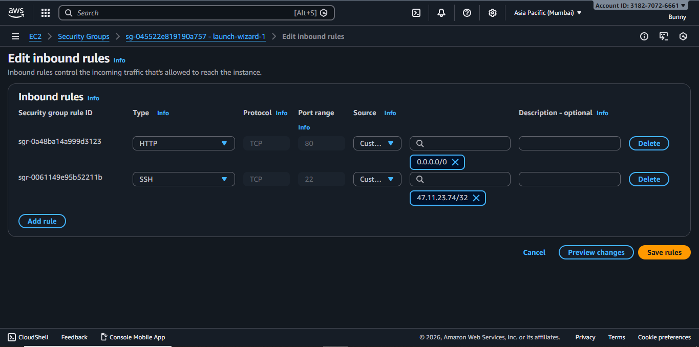
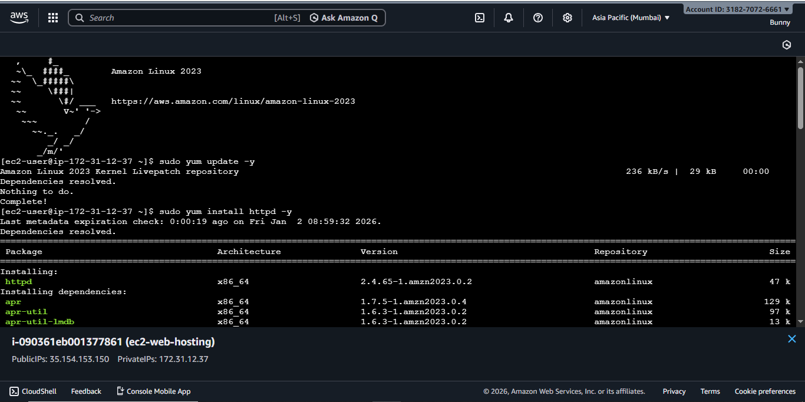
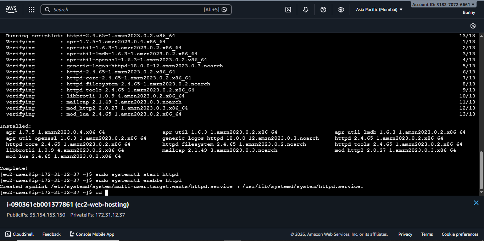

# AWS EC2 Web Hosting Project

## Project Overview
This project demonstrates hosting a static website on AWS EC2 using Apache web server.

## Services Used
- Amazon EC2
- Security Groups
- Amazon VPC
- Apache HTTP Server
- Linux (Amazon Linux 2)

## Steps Performed
1. Launched an EC2 instance with Amazon Linux 2
2. Configured Security Group to allow HTTP (80) and SSH (22)
3. Installed Apache web server
4. Deployed a static website
5. Verified website access via public IP

## Architecture
User → Internet → EC2 (Apache Web Server)

## Screenshots

### EC2 Instance Running

### Security Group Configuration

### Public IP

### Connect Successfully

### Appache Server Running

### Website Output

## Outcome
Successfully hosted a public website on AWS EC2 accessible via internet.

## Keywords
AWS, EC2, VPC, Security Groups, Apache, Linux, Cloud Computing

